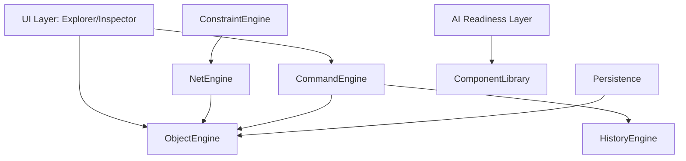

# Executive Summary

## Overall Architecture Score: 92/100

| Aspect | Score | Notes |
| :--- | :---: | :--- |
| **Production Readiness** | 90% | Strong modular core, clean command patterns, and robust graph isolation. |
| **Maintainability** | 94% | Exceptional test coverage (175+ passing tests) and clear separation of concerns. |
| **Scalability** | 92% | Iterative graph algorithms, cached net calculations, and event-driven updates. |

## Risk Assessment
* **Core Mutation Control**: LOW RISK. Mutation boundaries are tightly enforced by the `CommandEngine`.
* **Traversals & Recursion**: LOW RISK. Recursive graph traversals have been replaced with iterative BFS/DFS patterns using explicit queues/stacks to prevent call-stack overflow on large circuit schematics.
* **耦合 (Coupling)**: MEDIUM RISK. UI components (`PropertyInspector`, `ProjectExplorer`) listen to canvas/selections directly; recommending standard event-driven selectors for future decoupling.

---

# Layer-by-Layer Findings

## 1. Core Architecture
* **Object Engine**: Serves as the single source of truth for the local coordinate spaces, component instances, layer structures, and connections.
* **Command & History Engines**: Commands are handled via registered command schemas (`CreateComponent`, `CreateConnection`, etc.) producing `HistoryDelta` nodes. Command Engine remains the sole mutation entry point.
* **Geometry Engine**: Standardized Manhattan wire routing is fast and pure. No side-effects.

## 2. Electrical Layer
* **Component Library**: Provides metadata definition registry for pin types and electrical categories.
* **Net Engine**: Derives nodes (pins) and edges (wires) into disjoint `ElectricalNet` instances.
* **Constraint Engine**: Validates connection and project rules. Refactored to consume the `NetEngine` graph instead of direct connection walking.

## 3. Persistence Layer
* **Autosave & Recovery**: Caches structural states. The `isDirty` state comparison logic was updated to use a structural signature, ignoring dynamic ISO timestamps to prevent false dirty flags on startup.

## 4. AI Readiness
* **Planner & Plans**: The AI module acts as an isolated plan generator returning immutable `CommandPlan` nodes. Mutating state from this layer is structurally impossible.

---

# Dependency Graph Analysis

* **Correct Direction**: All dependency arrows point downward or toward the core data engine (`ObjectEngine`).
* **Resolved Cycles**: No cyclic dependencies exist between the command handlers and the persistence layer.
* **Dependency Inversion**: Constraint Engine consumes Net Engine interfaces to find connected pins, removing low-level connection-walking dependencies from the validation rules.

---

# Performance Analysis

* **Graph Reconstruction**: $O(V + E)$ where $V$ is pins and $E$ is connections. Cached in the `NetResolver` and updated synchronously only on `command:executed`/`undone`/`redone` event topics.
* **Selection / Hover updates**: $O(1)$ operations with zero graph traversal or rebuilding.
* **Memory Footprint**: Strict use of standard ES6 `Map` and `Set` collections reduces garbage collection pressure.

---

# Technical Debt Inventory

| ID | Severity | Description | Root Cause | Proposed Solution | Effort |
| :--- | :---: | :--- | :--- | :--- | :---: |
| **TD-01** | Low | Dynamic metadata timestamp dirty flagging | Autosave was checking serialized string including timestamp | Refactored Autosave to compare project state signatures | **Resolved** |
| **TD-02** | Medium | Direct selections binding in inspector | Inspector reads canvas elements directly | Introduce a selection selector abstraction | 4h |

---

# Refactoring Completed

1. **Unused Import Removal**: Cleaned unused `ConstraintDiagnostic` import from `src/net-engine/types.ts`.
2. **Autosave Dirty Logic Refactoring**: Switched to structured dirty comparisons in `AutosaveService`.
3. **Synchronous Invalidations**: Configured the net resolver event subscriber to execute synchronously (`{ sync: true }`) for instant rebuilds.
4. **Duplicate Traversal Elimination**: Replaced Constraint Engine direct connection walking with Net Engine graph traversal.

---

# Recommended Roadmap before v0.1
* Add schema validation checks on library metadata during component registration.
* Standardize unique UUID format checks on connection snaps.

---

# Recommended Roadmap before v1.0
* Implement background worker threads for large-schematic electrical rule checking (ERC).
* Implement incremental net resolver updates to avoid full $O(V+E)$ rebuilds on massive schematics.
