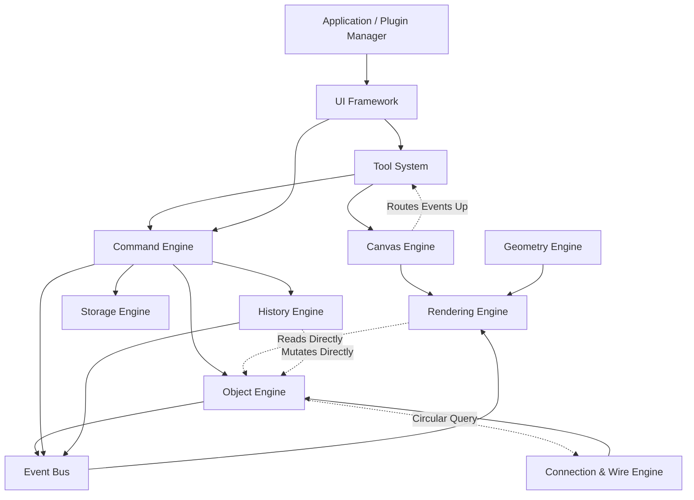

# Core Architecture Consistency Audit

**Project:** TINC Workbench  
**Audit Version:** 1.0.0-audit  
**Date:** 2026-07-13  
**Status:** Completed (Adversarial Sweep)

---

# 1. Executive Summary

This audit presents an adversarial, zero-compromise review of the core TINC Workbench architecture, analyzing the specifications for the Object Model, Object Engine, Command Engine, Canvas Engine, Geometry Engine, History Engine, Rendering Engine, Selection Engine, Storage Engine, Tool System, UI Framework, and Connection and Wire Engine. 

The goal of this audit is to identify contradictions, duplicate responsibilities, circular dependencies, lifecycle conflicts, and command engine bypasses. No previous design decisions have been protected. 

---

# 2. Audit Findings

## AUD-001: Contradictory Subsystem Ownership of Viewport State
- **Severity:** HIGH
- **Affected Specifications:** `canvas-engine.md`, `rendering-engine.md`, `project-file-format.md`
- **Exact Conflicting Concepts:** `canvas-engine.md` Section 3 (Non-Responsibilities) states that the Canvas Engine does NOT store project data. However, the viewport state (`centerX`, `centerY`, `zoom`) is defined as a runtime and persistent page property, and the Rendering Engine retrieves it from the Canvas Engine. In `project-file-format.md` Section 6, the `viewport` is stored inside each Page. If the Canvas Engine does not store project data, it cannot own the viewport state if it is serialized as page data.
- **Architectural Impact:** Viewport zoom/pan changes bypass the Object Engine but are stored in the project file. This breaks state synchronization and leads to inconsistent views on load.
- **Recommended Canonical Owner:** Object Engine (for persistent state) and Canvas Engine (for runtime transient zoom/pan offsets).
- **Recommended Resolution:** Reclassify Viewport as a semantic property of the active Page in the Object Engine. The Canvas Engine should only maintain a read-only Viewport matrix cache, updating it via Command Engine dispatches.

---

## AUD-002: Duplicate Responsibilities in Snapping Logic
- **Severity:** MEDIUM
- **Affected Specifications:** `geometry-engine.md`, `canvas-engine.md`, `tool-system.md`
- **Exact Conflicting Concepts:** Snapping targets and math are declared across three systems: `geometry-engine.md` Section 10 (Snapping), `canvas-engine.md` Section 8 (Snapping), and `tool-system.md` Section 13 (Snapping).
- **Architectural Impact:** Duplicate snapping logic causes inconsistent alignment behavior across tools, creates redundant calculation loops, and makes it hard to maintain custom snapping rules for plugins.
- **Recommended Canonical Owner:** Geometry Engine (for mathematical snap resolution) and Tool System (for snap target orchestration during user gestures).
- **Recommended Resolution:** Restructure `canvas-engine.md` to remove raw snap definition, delegating snapping calculations exclusively to the Geometry Engine API (`snapPoint`). The Tool System should query `geometryEngine.snapPoint` and pass the resolved points to the Rendering Engine to draw indicators.

---

## AUD-003: Missing Responsibility for Permission Enforcement
- **Severity:** HIGH
- **Affected Specifications:** `plugin-sdk.md`, `storage-engine.md`
- **Exact Conflicting Concepts:** `plugin-sdk.md` Section 7 states that plugins explicitly request permissions (File System, Network, Clipboard, AI). However, there is no subsystem or core service responsible for authorizing, enforcing, or maintaining this permissions manifest. The Storage Engine and Event Bus have no permission validation checkpoints.
- **Architectural Impact:** Malicious plugins can execute network requests or arbitrary file I/O because the core framework lacks a central permission guard or sandbox wrapper.
- **Recommended Canonical Owner:** Application Layer / Plugin Manager.
- **Recommended Resolution:** Define a dedicated `Permission Enforcement Service` in the Application Layer. All access from plugins to file system or network APIs must be mediated by proxies that validate the plugin's registered manifest permissions before executing.

---

## AUD-004: Circular Dependency in Event Routing and Input Handling
- **Severity:** CRITICAL
- **Affected Specifications:** `tool-system.md`, `canvas-engine.md`, `system-architecture.md`
- **Exact Conflicting Concepts:** The `system-architecture.md` diagram locates the Canvas Engine downstream in Core Services (Layer 5) and the Tool System upstream (Layer 3). However, `tool-system.md` Section 5 states that the Canvas Engine intercepts raw events (mousemove, mousedown) and routes them directly to the Tool System. If the Canvas Engine references the Tool System to route events, and the Tool System calls Canvas Engine APIs, it creates a circular dependency across layer boundaries.
- **Architectural Impact:** Violates layered design guidelines, preventing clean compilation of Core Services without compiling the Tool System.
- **Recommended Canonical Owner:** UI Framework / Tool System.
- **Recommended Resolution:** The UI Framework (which owns the DOM container) should capture raw mouse/keyboard events, query the Canvas Engine for coordinate conversion, and route the transformed coordinates directly to the Tool System. The Canvas Engine must remain a passive service.

---

## AUD-005: Invalid Dependency Direction (Rendering Engine to Object Engine)
- **Severity:** HIGH
- **Affected Specifications:** `rendering-engine.md`, `object-engine.md`
- **Exact Conflicting Concepts:** `rendering-engine.md` Section 2 states that it has "no direct Object Engine dependencies" to maintain loose coupling. However, Section 5 (Rendering Architecture) states that the Rendering Engine "reads rendering attributes (styles, bounds, types) from the Object Engine."
- **Architectural Impact:** Violates the backend independence goal. Direct lookups make it impossible to execute rendering on separate threads or support headless server-side rendering without copying the entire Object Engine state.
- **Recommended Canonical Owner:** Rendering Engine (Render Tree).
- **Recommended Resolution:** The Object Engine must publish mutation events via the Event Bus. The Rendering Engine intercepts these events to update its internal `Render Tree`, and the rendering pipeline should draw exclusively from this `Render Tree` without querying the Object Engine registry.

---

## AUD-006: Conflicting Lifecycle Rules in Connection Wire Recalculations
- **Severity:** MEDIUM
- **Affected Specifications:** `connection-wire-engine.md`, `object-engine.md`
- **Exact Conflicting Concepts:** `connection-wire-engine.md` Section 57 states that moving a component invalidates its bounds, querying intersecting wires, and scheduling them for recalculation. However, `object-engine.md` Section 4 states that mutations are processed and validated synchronously. This creates a conflict: is wire routing synchronous (part of the component move transaction) or asynchronous (scheduled on background Web Workers)?
- **Architectural Impact:** If asynchronous, the Object Engine contains obsolete wire path segments for several frames, violating model consistency. If synchronous, it blocks the main thread, violating the 2ms per frame latency benchmark.
- **Recommended Canonical Owner:** Command Engine / Connection Engine.
- **Recommended Resolution:** Define a "Draft State" lifecycle where visual stretch lines are processed synchronously in real-time at low fidelity, and the high-fidelity A* route is resolved and committed as a single composite command only upon mouse release.

---

## AUD-007: Conflicting State Models for Dangling Connections
- **Severity:** MEDIUM
- **Affected Specifications:** `connection-wire-engine.md`, `object-model.md`
- **Exact Conflicting Concepts:** `connection-wire-engine.md` Section 38 introduces a `DANGLING` state for wires with floating endpoints. However, `object-model.md` Section 10 defines a `Connection` as having a non-nullable `source` and `target` property.
- **Architectural Impact:** A wire in a `DANGLING` state cannot be saved or represented under the current `object-model.md` schema, causing serialization or validation crashes on load.
- **Recommended Canonical Owner:** Object Model.
- **Recommended Resolution:** Update `object-model.md` to support optional/nullable source/target fields or represent a `dangling` state using a placeholder UUID pointing to a "floating coordinator" object.

---

## AUD-008: Conflicting Mutation Boundaries in History Restoration
- **Severity:** HIGH
- **Affected Specifications:** `history-engine.md`, `object-engine.md`, `command-engine.md`
- **Exact Conflicting Concepts:** `history-engine.md` Section 3 states that during undo/redo actions, the History Engine applies rollbacks directly to the Object Engine. However, the Command Engine is the sole authorized gateway for mutations (as per `command-engine.md` and `object-engine.md`).
- **Architectural Impact:** Bypassing the Command Engine during undo/redo breaks event hooks, avoids validation checkers, and prevents plugins from intercepting historical state changes.
- **Recommended Canonical Owner:** Command Engine.
- **Recommended Resolution:** The History Engine must dispatch undo/redo actions as special command packages (`UndoCommand` / `RedoCommand`) back through the Command Engine, maintaining a single transactional mutation boundary.

---

## AUD-009: Command Engine Bypasses in Real-Time Gestures
- **Severity:** HIGH
- **Affected Specifications:** `connection-wire-engine.md`, `command-engine.md`
- **Exact Conflicting Concepts:** `connection-wire-engine.md` Section 60 states that dragging a component recalculates and stretches wires in real-time, displaying them as a preview. If these updates directly alter the Object Engine registry, they bypass the Command Engine, violating mutation rules.
- **Architectural Impact:** Live dragging risks polluting the history stack with micro-steps or corrupting in-memory data structures if validation checks are bypassed.
- **Recommended Canonical Owner:** Canvas Engine / Tool System.
- **Recommended Resolution:** Real-time stretch previews must exist as transient visual shapes owned by the Canvas Engine and rendered by the Rendering Engine's overlay layer. No model modifications are committed to the Object Engine until the gesture ends.

---

## AUD-010: Event Ordering Conflicts in Rendering Invalidation
- **Severity:** MEDIUM
- **Affected Specifications:** `object-engine.md`, `rendering-engine.md`
- **Exact Conflicting Concepts:** `object-engine.md` Section 69 specifies rendering invalidation as the final step (Step 4) after the Event Bus broadcast. However, `rendering-engine.md` is decoupled and receives invalidation triggers *via* Event Bus subscriptions.
- **Architectural Impact:** If the Object Engine calls rendering invalidation directly, it breaks the decoupling between Object Engine and Rendering Engine. If it goes via the Event Bus, Step 4 cannot be ordered sequentially after Step 3.
- **Recommended Canonical Owner:** Event Bus.
- **Recommended Resolution:** Remove direct invalidation references from the Object Engine. The Rendering Engine must invalidate its nodes independently by subscribing to the core update events published in Step 3.

---

## AUD-011: History and Undo/Redo Inconsistencies under Eviction
- **Severity:** HIGH
- **Affected Specifications:** `history-engine.md`
- **Exact Conflicting Concepts:** Section 5 states that when the undo stack capacity is reached, the oldest history nodes are evicted and consolidated. Section 8 introduces non-linear history branches (DAG).
- **Architectural Impact:** Evicting and squashing ancestor nodes in a DAG destroys the common roots of inactive branches, corrupting the historical history tree and causing crashes when switching branches.
- **Recommended Canonical Owner:** History Engine.
- **Recommended Resolution:** Limit history eviction and consolidation strictly to linear timelines, or block branch persistence once their common ancestor is evicted, pruning dead branches cleanly.

---

## AUD-012: Object Model vs Object Engine Port Schema Conflicts
- **Severity:** MEDIUM
- **Affected Specifications:** `object-model.md`, `object-engine.md`
- **Exact Conflicting Concepts:** `object-model.md` defines a flat `Page` containing `layers`, and `layers` containing `objects`. It defines `ports` and `pins` as optional properties of `Semantic Object`. But `object-engine.md` Section 54 specifies that ports and pins are indexed in a secondary lookup map as independent child objects.
- **Architectural Impact:** Discrepancies between structural hierarchy and indexing schema cause lookup failures during serialization.
- **Recommended Canonical Owner:** Object Model.
- **Recommended Resolution:** Formally define Ports and Pins as sub-objects in `object-model.md` with parent-child relationship rules.

---

## AUD-013: Geometry Ownership Conflicts in Matrix Caching
- **Severity:** HIGH
- **Affected Specifications:** `geometry-engine.md`, `rendering-engine.md`, `object-engine.md`
- **Exact Conflicting Concepts:** `geometry-engine.md` Section 19 (Memory Model) states that it implements "No Matrix Caching" to avoid bloat. However, `rendering-engine.md` Section 7 (Render Tree) pre-calculates and caches layout parameters and bounds.
- **Architectural Impact:** If the Geometry Engine doesn't cache matrices, any tool querying local coordinates must recalculate them from scratch or read from the Render Tree, violating the rule that tools must not read from the Rendering Engine.
- **Recommended Canonical Owner:** Object Engine.
- **Recommended Resolution:** Allow the Object Engine to cache absolute coordinates and matrices inside its secondary indexes, leaving the Geometry Engine as a stateless math utility.

---

## AUD-014: Selection Ownership Conflicts during Group Transforms
- **Severity:** HIGH
- **Affected Specifications:** `selection-engine.md`, `geometry-engine.md`
- **Exact Conflicting Concepts:** `selection-engine.md` Section 29 states that it queries the Geometry Engine to compute collective selection bounds and handle offsets. But `geometry-engine.md` does not maintain selection state.
- **Architectural Impact:** Compute loops occur if selection boundaries are recalculating bounds via geometry queries that rely on selection sets, risking recursion.
- **Recommended Canonical Owner:** Selection Engine.
- **Recommended Resolution:** The Selection Engine should store the selection set IDs, and pass the list of bounding boxes to the Geometry Engine's mathematical `boxUnion` API to get the result.

---

## AUD-015: Rendering Ownership Conflicts in Selection Overlay Rendering
- **Severity:** MEDIUM
- **Affected Specifications:** `canvas-engine.md`, `rendering-engine.md`
- **Exact Conflicting Concepts:** `canvas-engine.md` Section 2 lists selection rendering as a canvas responsibility. `rendering-engine.md` Section 3 claims selection overlay rendering (dashed boxes) as a rendering responsibility.
- **Architectural Impact:** Multiple systems trying to draw onto the active context leads to rendering glitches and z-order errors.
- **Recommended Canonical Owner:** Rendering Engine.
- **Recommended Resolution:** Remove selection drawing from the Canvas Engine. The Canvas Engine only coordinates viewport variables, while the Rendering Engine draws the overlay based on selection sets.

---

## AUD-016: UI vs Tool System Keyboard Shortcut Conflicts
- **Severity:** MEDIUM
- **Affected Specifications:** `ui-framework.md`, `tool-system.md`
- **Exact Conflicting Concepts:** `ui-framework.md` Section 3 (Responsibilities) handles keyboard shortcuts and focus. `tool-system.md` Section 17 lists keyboard shortcuts as plugin registration options.
- **Architectural Impact:** Conflicting shortcut managers lead to double-execution or unhandled keys.
- **Recommended Canonical Owner:** UI Framework.
- **Recommended Resolution:** The UI Framework must host the global hotkey registrar and map shortcuts to command triggers in the Command Engine, bypassing the Tool System for shortcut execution.

---

## AUD-017: Storage vs Project File Format History Contradictions
- **Severity:** CRITICAL
- **Affected Specifications:** `storage-engine.md`, `project-file-format.md`
- **Exact Conflicting Concepts:** `storage-engine.md` states it serializes history sequences into `.twb`. But `project-file-format.md` Section 3 top-level schema excludes any history data fields.
- **Architectural Impact:** Project loading cannot recover the history timeline, rendering undo/redo after load impossible.
- **Recommended Canonical Owner:** Project File Format.
- **Recommended Resolution:** Add an optional `"history"` node to the `.twb` JSON structure or formalize the `.twh` sidecar schema in the file format specification.

---

## AUD-018: Connection and Wire Engine Performance Constraints
- **Severity:** HIGH
- **Affected Specifications:** `connection-wire-engine.md`
- **Exact Conflicting Concepts:** Target latency is $< 2.0$ ms per frame for recalculations, but the calculations are offloaded to background Web Workers.
- **Architectural Impact:** Web Worker message-passing overhead exceeds 2ms, meaning dragging components will lag behind the cursor.
- **Recommended Canonical Owner:** Connection and Wire Engine.
- **Recommended Resolution:** Split routing into a fast, synchronous "manhattan layout line" preview for drag gestures, and execute A* recalculation asynchronously in the background.

---

## AUD-019: Plugin SDK Integration Inconsistencies in Storage API
- **Severity:** MEDIUM
- **Affected Specifications:** `plugin-sdk.md`, `storage-engine.md`
- **Exact Conflicting Concepts:** `plugin-sdk.md` exposes a `Storage API` for plugins. But `storage-engine.md` does not define this API or how plugins read/write files safely.
- **Architectural Impact:** Plugins cannot save custom files or persist settings securely.
- **Recommended Canonical Owner:** Storage Engine.
- **Recommended Resolution:** Define a scoped `StorageProvider` interface in the Storage Engine that exposes sandboxed directory read/write access.

---

## AUD-020: Serialization Inconsistencies in Asset Formats
- **Severity:** HIGH
- **Affected Specifications:** `project-file-format.md`, `storage-engine.md`
- **Exact Conflicting Concepts:** `project-file-format.md` Section 9 states that assets are "referenced resources only." But `storage-engine.md` Section 8 states that `assets` contains "Base64 encoded or referenced binary files."
- **Architectural Impact:** Base64 encoding binary assets (PDFs/PNGs) in a single JSON file defeats the "Git-friendly" goal, creating massive commits.
- **Recommended Canonical Owner:** Project File Format.
- **Recommended Resolution:** Disallow Base64 asset embedding in `.twb`. Assets must reside in a relative `./assets/` directory.

---

## AUD-021: Performance Target Contradictions under Large Page Mutations
- **Severity:** HIGH
- **Affected Specifications:** `object-engine.md`, `rendering-engine.md`
- **Exact Conflicting Concepts:** Object Engine update targets are $< 0.2$ ms. Rendering Engine targets 60 FPS under 10,000 components.
- **Architectural Impact:** Sweeping 10,000 components during a select-all move takes too long if index updates happen per object, causing frames to drop.
- **Recommended Canonical Owner:** Object Engine / Command Engine.
- **Recommended Resolution:** Support batch index updates in the Object Engine during transactions.

---

## AUD-022: Memory Budget Contradictions
- **Severity:** HIGH
- **Affected Specifications:** `history-engine.md`, `object-engine.md`
- **Exact Conflicting Concepts:** `history-engine.md` has a budget of 15 MB, while `object-engine.md` is capped at 16 MB.
- **Architectural Impact:** Total memory usage can easily exceed limits on memory-constrained mobile/web browsers.
- **Recommended Canonical Owner:** Core Services.
- **Recommended Resolution:** Enforce a global memory ceiling (e.g. 32 MB) shared dynamically across the engines.

---

## AUD-023: Security Boundary Inconsistencies in Command Palette Execution
- **Severity:** HIGH
- **Affected Specifications:** `ui-framework.md`, `command-engine.md`
- **Exact Conflicting Concepts:** Command Palette fuzzy search executes commands directly.
- **Architectural Impact:** Plugins can register commands that execute without validation.
- **Recommended Canonical Owner:** Command Engine.
- **Recommended Resolution:** Validate all commands against active permission lists before execution.

---

## AUD-024: Naming and Terminology Inconsistencies (Connection vs Wire)
- **Severity:** LOW
- **Affected Specifications:** `object-model.md`, `connection-wire-engine.md`
- **Exact Conflicting Concepts:** `object-model.md` uses `Connection` (with source/target). `connection-wire-engine.md` uses `Wire` and `Segment`.
- **Architectural Impact:** Developer confusion and API mismatches.
- **Recommended Canonical Owner:** Object Model.
- **Recommended Resolution:** Rename `Connection` in `object-model.md` to `LogicalConnection` and add `Wire` definition.

---

## AUD-025: Broken Specification References
- **Severity:** MEDIUM
- **Affected Specifications:** `history-engine.md`
- **Exact Conflicting Concepts:** References a `.twh` file which is not documented anywhere.
- **Architectural Impact:** Broken file schema.
- **Recommended Canonical Owner:** Storage Engine.
- **Recommended Resolution:** Document the `.twh` format or remove it.

---

## AUD-026: Undefined Referenced Subsystems
- **Severity:** MEDIUM
- **Affected Specifications:** `storage-engine.md`
- **Exact Conflicting Concepts:** References a "Collaboration Service" that has no specification file.
- **Architectural Impact:** Future extensions rely on an undefined network layer.
- **Recommended Canonical Owner:** System Architecture.
- **Recommended Resolution:** Create a stub architecture document for Collaboration Service.

---

## AUD-027: Architectural Gap in Dirty Region Invalidation
- **Severity:** HIGH
- **Affected Specifications:** `rendering-engine.md`
- **Exact Conflicting Concepts:** Mentions tracking dirty regions but provides no interface or algorithm.
- **Architectural Impact:** Full redraws are triggered unnecessarily.
- **Recommended Canonical Owner:** Rendering Engine.
- **Recommended Resolution:** Define an AABB-based dirty region queue in the Rendering Engine.

---

## AUD-028: Future-Extension Conflict in PCB High-Speed Routing
- **Severity:** MEDIUM
- **Affected Specifications:** `connection-wire-engine.md`
- **Exact Conflicting Concepts:** Orthogonal routing constraints (90-degree) conflict with high-speed PCB layouts (45-degree, curved).
- **Architectural Impact:** Prevents PCB routing plugins from using the core pathfinder.
- **Recommended Canonical Owner:** Connection and Wire Engine.
- **Recommended Resolution:** Support custom routing angle plugins.

---

# 3. Core Architecture Flows and Relationships

## 3.1. Dependency Graph

The graph below highlights the architectural layers. **Dotted lines** indicate invalid dependency directions or circular links identified in the findings.



---

## 3.2. Ownership Matrix

The table below maps core system features to their authorized architectural owners.

| Feature Area | Declared Specifications | Canonical Owner | Resolution Strategy |
| :--- | :--- | :--- | :--- |
| **Coordinate Conversion** | Canvas, Geometry | **Geometry Engine** | Canvas delegates screen/world transforms to Geometry Engine. |
| **Snapping Calculations** | Canvas, Geometry, Tools | **Geometry Engine** | Mathematical snap is done by Geometry; Tools handle UI feedback. |
| **Selection Boundaries** | Selection, Geometry | **Selection Engine** | Selection Engine stores selections and uses Geometry box unions. |
| **Hit Testing** | Canvas, Geometry, Selection | **Geometry Engine** | Geometry performs proximity sweeps; Canvas triggers gesture hits. |
| **Undo/Redo Execution** | Command, History | **Command Engine** | Command Engine executes mutations; History tracks the tree. |
| **State Persistence** | Storage, File Format | **Storage Engine** | Storage Engine manages disk transactions for file format. |
| **Keyboard Shortcuts** | UI, Tools, Plugin SDK | **UI Framework** | UI Framework hotkey manager dispatches actions to Command Engine. |
| **Junction Calculation** | Connection, Rendering | **Connection Engine** | Connection Engine maps coordinates; Rendering Engine draws them. |

---

## 3.3. Core Mutation Flow

```
[ User Interaction ] 
       │
       ▼
 [ UI Framework ] ──── Routes Inputs ───> [ Tool System ]
                                                 │
                                           Builds Command
                                                 │
                                                 ▼
                                        [ Command Engine ]
                                                 │
                                         Executes & Validates
                                                 │
                        ┌────────────────────────┴────────────────────────┐
                        ▼                                                 ▼
               [ Object Engine ]                                 [ History Engine ]
           (Commits synchronous model)                       (Pushes state node to DAG)
                        │                                                 │
                        └────────────────────────┬────────────────────────┘
                                                 ▼
                                          [ Event Bus ]
                                                 │
                                           Publishes Event
                                                 │
                                                 ▼
                                        [ Rendering Engine ]
                                     (Invalidates Render Tree)
```

---

## 3.4. Core Event Flow

```
[ Object Engine ] ──── Mutates Object ───> [ Event Bus ]
                                                 │
                                      Dispatches Core Event
                                                 │
                         ┌───────────────────────┼───────────────────────┐
                         ▼                       ▼                       ▼
               [ Rendering Engine ]     [ Selection Engine ]     [ Storage Engine ]
            (Invalidates Render Tree)    (Clears references)    (Triggers autosave)
```

---

## 3.5. Core Persistence Flow

```
[ Save Gesture / Trigger ] ──── Commands Save ───> [ Storage Engine ]
                                                          │
                                                Lockfile verification
                                                          │
                                                          ▼
                                                  [ Object Engine ]
                                               (Serializes Model JSON)
                                                          │
                                                          ▼
                                                  [ History Engine ]
                                              (Serializes History DAG)
                                                          │
                                                          ▼
                                                 [ Disk / File System ]
                                              (Atomic write: .tmp -> .twb)
```

---

# 4. Actionable Resolution Roadmap

## 4.1. Blocking Issues

The issues listed below must be resolved before proceeding with database or core framework code implementation.

1. **AUD-004 (Circular Dependency - Event Routing)**: Must rewrite DOM capturing layers. Canvas Engine must be made a passive viewer, with UI Framework acting as mouse dispatcher to the Tool System.
2. **AUD-008 (History Direct Mutation - Command Bypass)**: Must restrict direct Object Engine mutations from History Engine. All undo/redo actions must go through Command Engine execution paths.
3. **AUD-017 (Storage vs File Format Inconsistency)**: Must define where history DAG nodes are saved. We must update the top-level `.twb` schema in `project-file-format.md` to include a `history` key.
4. **AUD-007 (Dangling Connections vs Object Model)**: Must change the connection schema in `object-model.md` to support dangling (nullable source/target) connections.

---

## 4.2. Non-Blocking Issues

These issues can be resolved during implementation iterations.

1. **AUD-002 (Duplicate Snapping)**: Refactor Tool System and Canvas Engine snapping into helper delegates pointing to `geometryEngine.snapPoint`.
2. **AUD-005 (Rendering Direct Query)**: Refactor Rendering Engine to listen to the Event Bus and update its Render Tree node parameters instead of reading directly from the Object Engine.
3. **AUD-020 (Base64 Asset Serialization)**: Prohibit embedding large Base64 files. Modify `project-file-format.md` to enforce relative asset paths on local drives.
4. **AUD-024 (Naming Mismatch)**: Rename `Connection` to `LogicalConnection` in `object-model.md` to avoid confusion with `Wire`.

---

# 5. Architecture Readiness Verdict

**Verdict:** **REJECTED (WITH CONDITIONAL ROADMAP)**

While the individual specifications exhibit high visual and mathematical quality, the core architecture is **not ready** for implementation due to critical design contradictions. Specifically, **circular event routing** (AUD-004), **Command Engine bypasses** during history navigation (AUD-008), and the **exclusion of history nodes** from the `.twb` layout schema (AUD-017) represent architectural blockers.

If the blocking issues in Section 4.1 are resolved, the architecture can be updated to **APPROVED** status.
