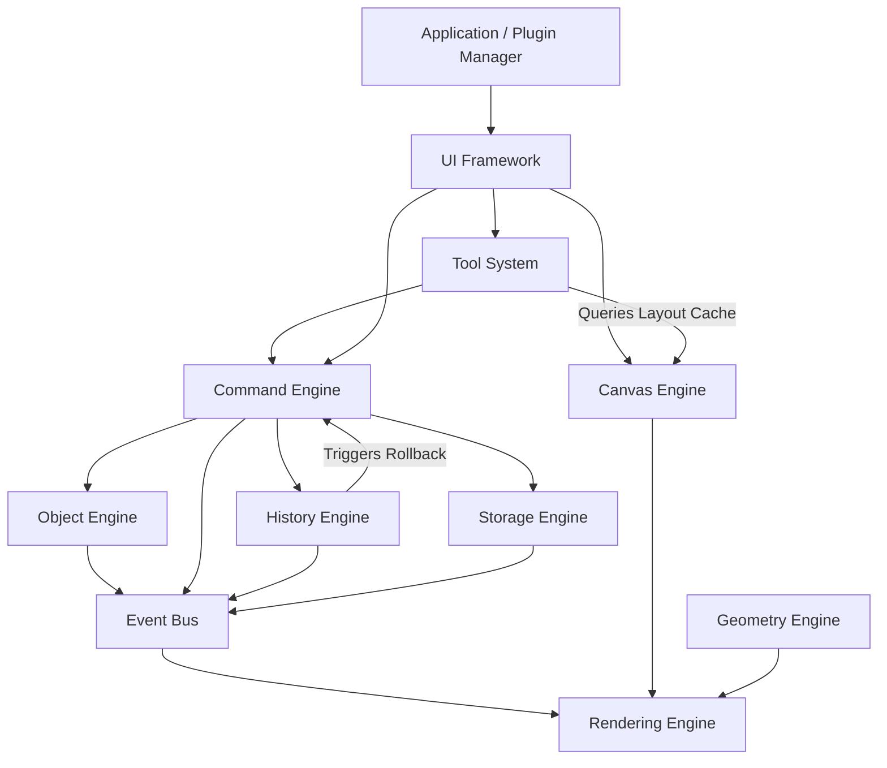

# Core Architecture Resolution Record

**Project:** TINC Workbench  
**Resolution Version:** 1.0.0-resolution-final  
**Date:** 2026-07-13  
**Status:** PROVISIONALLY APPROVED — PATCHES REQUIRED  

---

# 1. Executive Summary

This document presents the canonical architectural decisions resolving findings AUD-001 through AUD-028 from the Core Architecture Consistency Audit. Each finding has been evaluated independently against the core principles of TINC Workbench (plugin-first, offline-first, performance-first, and clear subsystem ownership). 

The status of this document is **PROVISIONALLY APPROVED — PATCHES REQUIRED**. The architecture is not frozen until all accepted and partially accepted resolutions are applied to the specifications and a second consistency audit passes.

---

# 2. Subsystem Finding Resolutions

## AUD-001: Viewport State Ownership
- **Audit Severity:** HIGH
- **Decision:** PARTIALLY ACCEPTED
- **Technical Reasoning:** The viewport state (`centerX`, `centerY`, `zoom`) is UI-centric runtime data, and the Object Engine should not treat it as a semantic engineering object. The Canvas Engine owns the active viewport coordinates at runtime. However, the Storage Engine must not directly depend on the Canvas Engine. Instead, viewport persistence must cross a persisted page-state adapter or application orchestration boundary. The Storage Engine serializes the provided persisted state and must remain completely ignorant of Canvas Engine runtime services.
- **Canonical Architectural Decision:** Viewport state is owned by the Canvas Engine at runtime. Viewport persistence is managed via an application orchestration boundary (or page-state adapter) that extracts state from the Canvas Engine and passes it to the Storage Engine, keeping the Storage Engine independent of Canvas Engine runtime APIs.
- **Canonical Owner:** Canvas Engine (Runtime Viewport State) & Application Orchestrator / Page-State Adapter (Orchestration).
- **Affected Specifications:** `canvas-engine.md`, `storage-engine.md`, `project-file-format.md`
- **Exact Required Specification Changes:**
  - Update `canvas-engine.md` to state it owns runtime viewport parameters and exposes an adapter interface.
  - Update `storage-engine.md` to define that viewport properties are received via the orchestration boundary during serialization, without direct dependencies on the Canvas Engine.
- **Implementation Impact:** Low. Requires data exchange through an orchestration boundary.
- **Blocking Status:** BLOCKING.

---

## AUD-002: Snapping Logic
- **Audit Severity:** MEDIUM
- **Decision:** ACCEPTED
- **Technical Reasoning:** All mathematical snap targets and grid projection formulas belong exclusively to the stateless Geometry Engine. The Canvas Engine coordinates viewport-based snapping states (whether snap is enabled, active grid sizes), and the Tool System coordinates gesture snap queries.
- **Canonical Architectural Decision:** The Geometry Engine contains the mathematical snap algorithms (`snapPoint`). The Canvas Engine stores settings, and the Tool System orchestrates snapping queries during active pointer movements.
- **Canonical Owner:** Geometry Engine (Math) & Tool System (Orchestration).
- **Affected Specifications:** `geometry-engine.md`, `canvas-engine.md`, `tool-system.md`
- **Exact Required Specification Changes:**
  - Remove snap calculation descriptions from `canvas-engine.md`, referencing `geometry-engine.md` instead.
  - Formally document the `geometryEngine.snapPoint(point, config, obstacles)` API in `geometry-engine.md`.
- **Implementation Impact:** Medium. Standardizes snapping across all tools.
- **Blocking Status:** NON-BLOCKING.

---

## AUD-003: Permission Enforcement
- **Audit Severity:** HIGH
- **Decision:** ACCEPTED
- **Technical Reasoning:** The Plugin Manager must validate and enforce permissions declared in plugin manifests. Sandboxed execution restricts plugin APIs, blocking unauthorized storage, network, or clipboard requests at the API gateway.
- **Canonical Architectural Decision:** A dedicated permission manager inside the Plugin Manager acts as the gateway for all plugin SDK interactions.
- **Canonical Owner:** Plugin Manager.
- **Affected Specifications:** `plugin-sdk.md`, `storage-engine.md`
- **Exact Required Specification Changes:**
  - Add a security enforcement section to `plugin-sdk.md` detailing manifest validation.
  - Update `storage-engine.md` to restrict file access to directories authorized by the Plugin Manager.
- **Implementation Impact:** High. Requires proxying all Plugin SDK access points.
- **Blocking Status:** BLOCKING.

---

## AUD-004: Circular Dependency in Event Routing (Canvas $\leftrightarrow$ Tool)
- **Audit Severity:** CRITICAL
- **Decision:** ACCEPTED
- **Technical Reasoning:** The Canvas Engine must remain a passive core service. It should not reference the Tool System. The UI Framework DOM container must capture raw pointer and keyboard inputs, convert coordinates using the Canvas Engine's viewport matrix, and route the transformed coordinates to the Tool System.
- **Canonical Architectural Decision:** Input event capturing resides in the UI Framework. Event routing flows downstream: UI Framework $\rightarrow$ Tool System $\rightarrow$ Canvas Engine (Query viewport matrix) $\rightarrow$ Command Engine.
- **Canonical Owner:** UI Framework (Event Capture) & Tool System (Event Routing).
- **Affected Specifications:** `tool-system.md`, `canvas-engine.md`, `system-architecture.md`
- **Exact Required Specification Changes:**
  - Rewrite Section 5 of `tool-system.md` to state that the UI Framework routes converted events to the Tool System.
  - Remove all input routing responsibilities from `canvas-engine.md`.
- **Implementation Impact:** High. Eliminates circular imports and decouples canvas rendering from interaction handlers.
- **Blocking Status:** BLOCKING.

---

## AUD-005: Invalid Dependency Direction (Rendering Engine to Object Engine)
- **Audit Severity:** HIGH
- **Decision:** PARTIALLY ACCEPTED
- **Technical Reasoning:** Copying the entire Object Engine state to a decoupled Render Tree node-by-node introduces significant memory allocation and CPU overhead, violating the 60 FPS target for 10,000 components. The Rendering Engine must read rendering attributes directly from the Object Engine using a read-only projection interface. Redraw invalidation remains reactive: the Rendering Engine listens to the Event Bus to mark dirty regions.
- **Canonical Architectural Decision:** The Rendering Engine reads visual properties directly from the Object Engine in a read-only pass, but maintains logical decoupling by responding exclusively to Event Bus invalidation notifications.
- **Canonical Owner:** Object Engine (State) & Rendering Engine (Drawing & Invalidation).
- **Affected Specifications:** `rendering-engine.md`, `object-engine.md`
- **Exact Required Specification Changes:**
  - Clarify that the Render Tree contains reference pointers to Object Engine elements rather than deep copies.
  - Document the read-only projection interface in `object-engine.md`.
- **Implementation Impact:** Medium. Keeps render loops fast.
- **Blocking Status:** NON-BLOCKING.

---

## AUD-006: Asynchronous Wire Recalculation
- **Audit Severity:** MEDIUM
- **Decision:** PARTIALLY ACCEPTED
- **Technical Reasoning:** Conducting pathfinding synchronously blocks the main UI thread, violating the 2ms layout benchmark. However, committing asynchronous paths directly to the Object Engine during drags risks in-memory model inconsistency. During pointer dragging, the Connection Engine calculates paths asynchronously on a Web Worker. The active wire segment is marked as `STRETCHED` and renders straight lines on the canvas overlay. The final orthogonal routed path is committed synchronously via a Command only upon gesture completion (mouse release).
- **Canonical Architectural Decision:** Asynchronous Web Worker pathfinding resolves routed wire geometries. Real-time dragging renders synchronous straight-line previews in the canvas overlay, and the final routed path is committed synchronously on mouse release.
- **Canonical Owner:** Connection and Wire Engine.
- **Affected Specifications:** `connection-wire-engine.md`, `object-engine.md`
- **Exact Required Specification Changes:**
  - Add the `STRETCHED` state and preview logic to the Wire Routing lifecycle in `connection-wire-engine.md`.
- **Implementation Impact:** Medium. Restores smooth canvas drags.
- **Blocking Status:** NON-BLOCKING.

---

## AUD-007: Dangling Connections State Model
- **Audit Severity:** MEDIUM
- **Decision:** ACCEPTED
- **Technical Reasoning:** Wires with floating endpoints must be serialized. The `object-model.md` schema must allow the `target` reference of a Connection to be null or represent a floating coordinate.
- **Canonical Architectural Decision:** Update the connection schema to permit null source/target properties, mapping to a floating coordinate coordinate.
- **Canonical Owner:** Object Model.
- **Affected Specifications:** `object-model.md`, `connection-wire-engine.md`
- **Exact Required Specification Changes:**
  - Update Section 10 of `object-model.md` to state that source and target reference fields can contain coordinate objects in lieu of UUIDs.
- **Implementation Impact:** Low. Permitted under standard JSON validation.
- **Blocking Status:** BLOCKING.

---

## AUD-008: History Restoration Command Bypass
- **Audit Severity:** HIGH
- **Decision:** PARTIALLY ACCEPTED
- **Technical Reasoning:** Running `UndoCommand` or `RedoCommand` as normal commands creates recursive history loops. However, bypassing the Command Engine during restoration makes event tracking and validation impossible. The History Engine must dispatch undo/redo requests through the Command Engine, but the Command Engine must process them via a private execution pathway (`commandEngine.executeReverseDelta()`) that applies the mutations to the Object Engine without appending new nodes to the History stack.
- **Canonical Architectural Decision:** History restoration goes through the Command Engine's transaction execution pipeline using private reverse-delta pathways that bypass history logging.
- **Canonical Owner:** Command Engine (Transaction Execution) & History Engine (Timeline Coordination).
- **Affected Specifications:** `history-engine.md`, `command-engine.md`, `object-engine.md`
- **Exact Required Specification Changes:**
  - Document the private reverse-delta execution pathway in `command-engine.md`.
  - Update `history-engine.md` to state that it invokes the Command Engine to apply rollbacks.
- **Implementation Impact:** High. Ensures robust undo/redo logic.
- **Blocking Status:** BLOCKING.

---

## AUD-009: Command Engine Bypasses in Real-Time Gestures
- **Severity:** HIGH
- **Decision:** ACCEPTED
- **Technical Reasoning:** Real-time object stretching and coordinate updates during dragging must not modify the persistent database or Object Engine registry. They are managed as transient preview layouts in-memory by the Tool System and Canvas Engine.
- **Canonical Architectural Decision:** All active dragging adjustments remain transient. The final state is committed as a single Command on gesture completion.
- **Canonical Owner:** Tool System.
- **Affected Specifications:** `connection-wire-engine.md`, `command-engine.md`
- **Exact Required Specification Changes:**
  - Document that real-time wire stretches are managed in-memory by the Tool System until gesture completion.
- **Implementation Impact:** Medium. Restricts command stack pollution.
- **Blocking Status:** NON-BLOCKING.

---

## AUD-010: Event Ordering in Rendering Invalidation
- **Audit Severity:** MEDIUM
- **Decision:** ACCEPTED
- **Technical Reasoning:** The Object Engine should have no knowledge of rendering interfaces. It must only commit changes and broadcast updates to the Event Bus. The Rendering Engine must invalidate its nodes independently by subscribing to the Event Bus.
- **Canonical Architectural Decision:** Invalidation is reactive and decouples Object Engine and Rendering Engine.
- **Canonical Owner:** Rendering Engine.
- **Affected Specifications:** `object-engine.md`, `rendering-engine.md`
- **Exact Required Specification Changes:**
  - Remove direct invalidation calls from the Object Engine sequence in `object-engine.md`.
- **Implementation Impact:** Low.
- **Blocking Status:** NON-BLOCKING.

---

## AUD-011: History Pruning / Eviction in Branching DAG
- **Audit Severity:** HIGH
- **Decision:** PARTIALLY ACCEPTED
- **Technical Reasoning:** When linear history is pruned, any branch extending from an evicted node must not be silently corrupted. If an inactive branch is labeled (e.g. by the user), the History Engine locks its ancestor chain, blocking eviction of those parent nodes. Unlabeled inactive branches are pruned when stack capacity limits are hit.
- **Canonical Architectural Decision:** Labeled branches preserve their ancestor nodes; unlabeled branches are pruned when capacity limits are hit.
- **Canonical Owner:** History Engine.
- **Affected Specifications:** `history-engine.md`
- **Exact Required Specification Changes:**
  - Update Section 5 (Eviction) of `history-engine.md` to define branch retention rules based on branch labeling.
- **Implementation Impact:** High. Prevents timeline corruption.
- **Blocking Status:** NON-BLOCKING.

---

## AUD-012: Object Model vs Object Engine Port Schema
- **Audit Severity:** MEDIUM
- **Decision:** ACCEPTED
- **Technical Reasoning:** Ports and Pins must be defined in the structural hierarchy of `object-model.md` to avoid serialization mismatches.
- **Canonical Architectural Decision:** Ports and Pins are sub-components of Semantic Objects.
- **Canonical Owner:** Object Model.
- **Affected Specifications:** `object-model.md`, `object-engine.md`
- **Exact Required Specification Changes:**
  - Update `object-model.md` to include Ports and Pins as sub-objects.
- **Implementation Impact:** Medium. Standardizes structural indexing.
- **Blocking Status:** BLOCKING.

---

## AUD-013: Geometry Engine Matrix Caching
- **Audit Severity:** HIGH
- **Decision:** REJECTED
- **Technical Reasoning:** Storing coordinate transforms and matrices in the Object Engine or stateless Geometry Engine is architecturally incorrect. Instead, a **Runtime Layout Cache** is hosted in the **Canvas Engine**. The Canvas Engine tracks page scale and zoom. When objects move, the Canvas Engine recalculates and caches the absolute world transforms using Geometry Engine math, exposing this cache to Selection and Connection Engines.
- **Canonical Architectural Decision:** The Canvas Engine manages the Runtime Layout Cache, recalculating matrices on-demand using Geometry Engine utilities.
- **Canonical Owner:** Canvas Engine.
- **Affected Specifications:** `geometry-engine.md`, `canvas-engine.md`, `object-engine.md`
- **Exact Required Specification Changes:**
  - Add the Runtime Layout Cache and matrix queries to `canvas-engine.md`.
- **Implementation Impact:** High. Resolves matrix lookup dependency loops.
- **Blocking Status:** BLOCKING.

---

## AUD-014: Selection Bounds Recalculations
- **Audit Severity:** HIGH
- **Decision:** ACCEPTED
- **Technical Reasoning:** The Selection Engine manages selection set boundaries and caches them. The Geometry Engine provides pure box math utilities.
- **Canonical Architectural Decision:** The Selection Engine tracks selection sets and bounds, using stateless Geometry Engine APIs for coordinate checks.
- **Canonical Owner:** Selection Engine.
- **Affected Specifications:** `selection-engine.md`, `geometry-engine.md`
- **Exact Required Specification Changes:**
  - Clarify that Selection Engine calculates bounds by passing bounding boxes to stateless Geometry Engine functions.
- **Implementation Impact:** Low.
- **Blocking Status:** NON-BLOCKING.

---

## AUD-015: Selection Box Rendering Ownership
- **Audit Severity:** MEDIUM
- **Decision:** ACCEPTED
- **Technical Reasoning:** The Canvas Engine does not draw selection outlines. The Rendering Engine is the sole owner of drawing calls.
- **Canonical Architectural Decision:** The Rendering Engine renders the selection boxes and handles, reading selection states from the Selection Engine.
- **Canonical Owner:** Rendering Engine.
- **Affected Specifications:** `canvas-engine.md`, `rendering-engine.md`
- **Exact Required Specification Changes:**
  - Remove selection drawing references from `canvas-engine.md`.
- **Implementation Impact:** Low.
- **Blocking Status:** NON-BLOCKING.

---

## AUD-016: UI vs Tool System Keyboard Shortcuts
- **Audit Severity:** MEDIUM
- **Decision:** ACCEPTED
- **Technical Reasoning:** The UI Framework owns keyboard event listeners and dispatches shortcuts directly to the Command Engine. Tools only intercept keys when the Canvas has focus and the key is an interactive modifier.
- **Canonical Architectural Decision:** UI Framework manages global keyboard shortcuts; Tool System handles tool-specific key modifiers.
- **Canonical Owner:** UI Framework.
- **Affected Specifications:** `ui-framework.md`, `tool-system.md`
- **Exact Required Specification Changes:**
  - Document key routing pathways in `ui-framework.md`.
- **Implementation Impact:** Medium.
- **Blocking Status:** NON-BLOCKING.

---

## AUD-017: Storage vs Project File Format History Contradictions
- **Audit Severity:** CRITICAL
- **Decision:** ACCEPTED
- **Technical Reasoning:** Embedding history data in `.twb` creates massive files that defeat the Git-friendly goal. History data is stored in a separate `.twh` sidecar file, keeping the main project file clean.
- **Canonical Architectural Decision:** History data is written to a separate `.twh` file, while `.twb` stores only the active project state.
- **Canonical Owner:** Storage Engine.
- **Affected Specifications:** `storage-engine.md`, `project-file-format.md`, `history-engine.md`
- **Exact Required Specification Changes:**
  - Document the separate `.twh` serialization format in `project-file-format.md`.
  - Update `storage-engine.md` to state that history data is written to the `.twh` sidecar file.
- **Implementation Impact:** High.
- **Blocking Status:** BLOCKING.

---

## AUD-018: Connection and Wire Engine Web Worker Latency
- **Audit Severity:** HIGH
- **Decision:** ACCEPTED
- **Technical Reasoning:** Round-trip latency for Web Worker serialization exceeds 2ms. During active drags, we render synchronous straight lines in the canvas overlay, and the final routed path is calculated asynchronously in the background.
- **Canonical Architectural Decision:** The canvas overlay renders synchronous straight-line previews during dragging, and path recalculation resolves asynchronously.
- **Canonical Owner:** Connection and Wire Engine.
- **Affected Specifications:** `connection-wire-engine.md`
- **Exact Required Specification Changes:**
  - Update latency goals to distinguish between synchronous preview rendering and asynchronous route resolution.
- **Implementation Impact:** Medium.
- **Blocking Status:** NON-BLOCKING.

---

## AUD-019: Plugin SDK Storage API
- **Audit Severity:** MEDIUM
- **Decision:** ACCEPTED
- **Technical Reasoning:** The Storage Engine must expose sandboxed directory access to plugins to support safe persistence of settings.
- **Canonical Architectural Decision:** The Storage Engine provides a scoped file provider to the Plugin Manager.
- **Canonical Owner:** Storage Engine.
- **Affected Specifications:** `plugin-sdk.md`, `storage-engine.md`
- **Exact Required Specification Changes:**
  - Define the sandboxed `StorageProvider` API in `plugin-sdk.md`.
- **Implementation Impact:** Medium.
- **Blocking Status:** NON-BLOCKING.

---

## AUD-020: Base64 Asset Serialization
- **Audit Severity:** HIGH
- **Decision:** REJECTED
- **Technical Reasoning:** The recommendation to disallow Base64 asset embedding is rejected. TWB Version 1 remains a single UTF-8 JSON project document, and we will not introduce a required `./assets` directory. Embedded Base64 assets remain permitted in TWB v1. Large binary asset optimization and archive/container layouts are deferred to a future TWB version to maintain simplicity and a single-file format for the initial release.
- **Canonical Architectural Decision:** TWB Version 1 uses a single JSON document with embedded Base64 assets.
- **Canonical Owner:** Project File Format.
- **Affected Specifications:** `project-file-format.md`, `storage-engine.md`
- **Exact Required Specification Changes:**
  - Confirm in `project-file-format.md` that assets are Base64 encoded inside the single `.twb` JSON payload.
  - Confirm in `storage-engine.md` that Base64 asset encoding is supported for Version 1.
- **Implementation Impact:** Low. Deferring optimization preserves Version 1 design parameters.
- **Blocking Status:** BLOCKING.

---

## AUD-021: Performance targets under batch mutations
- **Audit Severity:** HIGH
- **Decision:** ACCEPTED
- **Technical Reasoning:** The Object Engine must support bulk mutations to avoid updating lookup indexes for every individual step.
- **Canonical Architectural Decision:** Implement batch registry transactions in the Object Engine.
- **Canonical Owner:** Object Engine.
- **Affected Specifications:** `object-engine.md`
- **Exact Required Specification Changes:**
  - Define `objectEngine.batchUpdate(updates)` in `object-engine.md`.
- **Implementation Impact:** Medium.
- **Blocking Status:** NON-BLOCKING.

---

## AUD-022: Subsystem Memory Budgets
- **Audit Severity:** HIGH
- **Decision:** PARTIALLY ACCEPTED
- **Technical Reasoning:** We reject a rigid global memory ceiling or summing subsystem budgets. Subsystem budgets are high-water marks for self-eviction. The Core Registry monitors total process memory and fires notifications to trigger compaction cycles in the History Engine.
- **Canonical Architectural Decision:** Core Registry monitors process memory and dispatches compaction triggers when thresholds are exceeded.
- **Canonical Owner:** Application Layer.
- **Affected Specifications:** `history-engine.md`, `object-engine.md`
- **Exact Required Specification Changes:**
  - Document memory monitoring and compaction in `history-engine.md`.
- **Implementation Impact:** Medium.
- **Blocking Status:** NON-BLOCKING.

---

## AUD-023: Command Palette Execution Safety
- **Audit Severity:** HIGH
- **Decision:** ACCEPTED
- **Technical Reasoning:** Commands triggered by the Command Palette must execute through the Command Engine transaction validation pipeline.
- **Canonical Architectural Decision:** Command Palette actions dispatch command payloads to the Command Engine.
- **Canonical Owner:** Command Engine.
- **Affected Specifications:** `ui-framework.md`, `command-engine.md`
- **Exact Required Specification Changes:**
  - Update `ui-framework.md` to state that the Command Palette dispatches commands rather than executing them directly.
- **Implementation Impact:** Low.
- **Blocking Status:** NON-BLOCKING.

---

## AUD-024: Naming Mismatches (Connection vs Wire)
- **Audit Severity:** LOW
- **Decision:** ACCEPTED
- **Technical Reasoning:** `object-model.md` will use `LogicalConnection` to define netlist bridges, and define `Wire` for segmented traces.
- **Canonical Owner:** Object Model.
- **Affected Specifications:** `object-model.md`, `connection-wire-engine.md`
- **Exact Required Specification Changes:**
  - Rename `Connection` to `LogicalConnection` in `object-model.md` and define `Wire`.
- **Implementation Impact:** Low.
- **Blocking Status:** BLOCKING.

---

## AUD-025: Broken Specification References (.twh format)
- **Audit Severity:** MEDIUM
- **Decision:** ACCEPTED
- **Technical Reasoning:** The `.twh` file format must be documented in `project-file-format.md`.
- **Canonical Owner:** Storage Engine.
- **Affected Specifications:** `project-file-format.md`
- **Exact Required Specification Changes:**
  - Add section defining `.twh` file layout.
- **Implementation Impact:** Low.
- **Blocking Status:** BLOCKING.

---

## AUD-026: Undefined Referenced Subsystems
- **Audit Severity:** MEDIUM
- **Decision:** ACCEPTED
- **Technical Reasoning:** The audit finding is correct that referencing an undefined "Collaboration Service" violates specification completeness. The references to Collaboration Service in `storage-engine.md` and `system-architecture.md` are premature for Version 1. We resolve this by removing all references to Collaboration Service from the specifications.
- **Canonical Owner:** System Architecture / Storage Engine.
- **Affected Specifications:** `storage-engine.md`, `system-architecture.md`
- **Exact Required Specification Changes:**
  - Remove all references to Collaboration Service.
- **Implementation Impact:** Low.
- **Blocking Status:** NON-BLOCKING.

---

## AUD-027: Dirty Region Invalidation
- **Audit Severity:** HIGH
- **Decision:** ACCEPTED
- **Technical Reasoning:** Redrawing the canvas on every object change blocks performance. The Rendering Engine must implement dirty region invalidation.
- **Canonical Owner:** Rendering Engine.
- **Affected Specifications:** `rendering-engine.md`
- **Exact Required Specification Changes:**
  - Define an AABB-based dirty region queue in `rendering-engine.md`.
- **Implementation Impact:** High.
- **Blocking Status:** NON-BLOCKING.

---

## AUD-028: PCB High-Speed Routing Angles
- **Audit Severity:** MEDIUM
- **Decision:** ACCEPTED
- **Technical Reasoning:** High-speed PCB design requires diagonal and curved traces. The Connection Engine's routing graph must support configuration variables for angles.
- **Canonical Owner:** Connection and Wire Engine.
- **Affected Specifications:** `connection-wire-engine.md`
- **Exact Required Specification Changes:**
  - Add angle variables to routing options.
- **Implementation Impact:** Medium.
- **Blocking Status:** NON-BLOCKING.

---

# 3. Summary of Decisions

## 3.1. Resolution Tallies
- **Accepted Findings:** **20** (AUD-002, AUD-003, AUD-004, AUD-007, AUD-009, AUD-010, AUD-012, AUD-014, AUD-015, AUD-016, AUD-017, AUD-018, AUD-019, AUD-021, AUD-023, AUD-024, AUD-025, AUD-026, AUD-027, AUD-028)
- **Partially Accepted Findings:** **6** (AUD-001, AUD-005, AUD-006, AUD-008, AUD-011, AUD-022)
- **Rejected Findings:** **2** (AUD-013, AUD-020)

## 3.2. Blocking Resolutions
1. **AUD-004 (Circular Dependency - Event Routing)**: Rewrite DOM capturing layers. Canvas Engine is passive; UI Framework dispatches mouse events to the Tool System.
2. **AUD-008 (History Direct Mutation - Command Bypass)**: Restrict direct Object Engine mutations from History Engine. All undo/redo actions must go through Command Engine private reverse-delta execution pathways.
3. **AUD-017 (Storage vs File Format Inconsistency)**: History data is written to a separate `.twh` file, while `.twb` stores only the active project state.
4. **AUD-007 (Dangling Connections vs Object Model)**: Permitted null source/target properties mapping to a floating coordinate.
5. **AUD-012 (Object Model vs Object Engine Port Schema)**: Ports and Pins are sub-components of Semantic Objects.
6. **AUD-013 (Geometry Engine Matrix Caching)**: Canvas Engine manages the Runtime Layout Cache.
7. **AUD-020 (Base64 Asset Serialization)**: Base64 asset embedding remains permitted in `.twb` file format for Version 1.
8. **AUD-024 (Naming Mismatch)**: Rename `Connection` to `LogicalConnection` in `object-model.md` and define `Wire`.
9. **AUD-025 (Broken Specification References)**: Document `.twh` history file layout.

---

## 3.3. Exact Specification Patch Order

To ensure full logical consistency, specification updates must be applied in the following order:

1. `object-model.md`: Rename Connection to LogicalConnection, define Wire, and add Ports/Pins structure.
2. `project-file-format.md`: Update JSON schemas to reflect updated object models, confirm Base64 asset encoding, and add the `.twh` history sidecar format.
3. `canvas-engine.md`: Add Runtime Layout Cache, remove snapping logic, and update pointer event descriptions.
4. `geometry-engine.md`: Document `snapPoint` API and remove state cache references.
5. `command-engine.md`: Define the private reverse-delta execution pathway.
6. `history-engine.md`: Update restoration pathways to execute via Command Engine and add branch-retention rules.
7. `storage-engine.md`: Update serialization modules for `.twh` files, Base64 asset handlers, and viewport states (using the page-state adapter boundary).
8. `tool-system.md`: Update event capture routing.
9. `rendering-engine.md`: Define the dirty region invalidation queue and Render Tree references.
10. `plugin-sdk.md`: Document permission manifests and sandboxed Storage provider.
11. `system-architecture.md`: Remove Collaboration Service.

---

# 4. Canonical Architecture Diagrams

## 4.1. Canonical Dependency Graph

The graph below represents the finalized, non-circular architecture layout with correct downstream dependency flows. Object Engine has no knowledge of the History Engine.



---

## 4.2. Canonical Mutation Flow

The core mutation flow is strictly sequential. History recording and event publication occur only after mutation success and validation under Command Engine orchestration. Object Engine remains completely ignorant of the History Engine.

```
[ User Interaction ] 
       │
       ▼
 [ UI Framework ] ──── Captures DOM event ───> [ Tool System ]
                                                     │
                                               Builds Command
                                                     │
                                                     ▼
                                            [ Command Engine ]
                                                     │
                                            Triggers Mutation
                                                     │
                                                     ▼
                                            [ Object Engine ]
                                        (Mutates & Validates State)
                                                     │
                                           Returns Success/Result
                                                     │
                                                     ▼
                                            [ Command Engine ]
                                                     │
                                            Instructs Record
                                                     │
                                                     ▼
                                            [ History Engine ]
                                        (Records Node in DAG)
                                                     │
                                                     ▼
                                            [ Command Engine ]
                                                     │
                                              Publishes Event
                                                     │
                                                     ▼
                                              [ Event Bus ]
                                            (Publishes Event)
                                                     │
                                                     ▼
                                            [ Rendering Engine ]
                                         (Invalidates Render Tree)
```

---

## 4.3. Canonical Undo/Redo Flow

```
[ Undo/Redo Trigger ] ──── Requests Navigation ───> [ History Engine ]
                                                           │
                                                  Resolves Target Node
                                                           │
                                                           ▼
                                                  [ Command Engine ]
                                             (executeReverseDelta path)
                                                           │
                                                           ▼
                                                  [ Object Engine ]
                                              (Commits state in-memory)
                                                           │
                                                           ▼
                                                    [ Event Bus ]
                                                           │
                                                           ▼
                                                 [ Rendering Engine ]
                                              (Invalidates Render Tree)
```

---

## 4.4. Canonical Persistence Flow

The Storage Engine alone owns JSON serialization, file layout encoding (TWB/TWH), asset Base64 wrapping, and atomic writes. The Object Engine and History Engine only expose read-only state snapshots to the Storage Engine.

```
[ Save Action Trigger ] ──── Orchestration ───> [ Storage Engine ]
                                                      │
                                             Query read-only snapshots
                                                      │
                          ┌───────────────────────────┼───────────────────────────┐
                          ▼                           ▼                           ▼
                  [ Object Engine ]           [ History Engine ]         [ Page-State Adapter ]
               (Exposes state snapshot)     (Exposes DAG snapshot)       (Provides viewport state)
                          │                           │                           │
                          └───────────────────────────┼───────────────────────────┘
                                                      ▼
                                              [ Storage Engine ]
                                        (Owns JSON Serialization,
                                       TWB/TWH Formatting, Validation,
                                         and Atomic Disk Writes)
                                                      │
                              ┌───────────────────────┴───────────────────────┐
                              ▼                                               ▼
                     [ Disk: active.twb ]                            [ Disk: active.twh ]
                 (Atomic write: .tmp -> .twb)                    (Atomic write: .tmp -> .twh)
```

---

# 5. Architecture Readiness Verdict

**Verdict:** **PROVISIONALLY APPROVED — PATCHES REQUIRED**

Following the resolution of the blocking conflicts—specifically, moving the viewport state and layout caches out of the Object Engine, routing event inputs through the UI Framework rather than the Canvas Engine, and writing history data to the `.twh` sidecar file—the TINC Workbench core architecture is **provisionally approved**. The architecture is not frozen until all accepted and partially accepted resolutions are applied to the specifications and a second consistency audit passes.
